# Railway Journey Routing

Given a source station, a destination, a date and an earliest start time, return the **50 unique valid
journeys that arrive earliest** (the original specification asked for 20; K is configurable), across any number of transfers (internal cap 10), with a 30-minute
minimum transfer, operating days and multi-day (overnight) schedules honored.

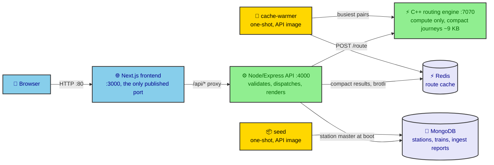

The same API and engine images also run as a distributed system: one API tier dispatching to many
single-core engine workers, deployed on 10 AWS hosts for a load-testing study. See
[Scaling architecture](#scaling-architecture) and [Scaling study](#scaling-study-on-aws).

- **routing-engine/**: C++20 long-running HTTP service that only computes. Loads the preprocessed timetable
  once and answers `POST /route` in single-digit to tens of milliseconds with compact journeys (timetable
  indices and absolute minutes), plus `/health` and `/metrics`.
- **api/**: Express 5 + zod + pino. Validation, station search, dispatch to the engine workers, route cache,
  filters, pagination, and rendering of the returned page (names, stops, datetimes) from its own copy of
  the timetable. `src/warmer.ts` is the one-shot cache-warmer.
- **frontend/**: Next.js 16 (App Router), React 19, Tailwind 4, Leaflet. Station autocomplete, results
  timeline, a route map drawn in the browser from bundled station coordinates, client-side filters and
  sorting, pagination.
- **scripts/**: Node/TypeScript preprocessing pipeline: validation, cleaning, quality report, and the
  routing-optimized timetable.
- **MongoDB**: persistence for stations, trains and ingest reports. Hot routing never touches it.
- **deploy/**: Terraform and scripts that put the API and engine workers on 10 AWS hosts.
- **loadtest/**: k6 workloads and scenarios, a local rehearsal stack, the experiment runner and the
  analysis script.

Contents: [Quick start](#quick-start) · [Repository layout](#repository-layout) ·
[Data](#data-findings-and-cleaning) · [Temporal model](#temporal-model) · [Problem](#problem-formulation) ·
[Algorithm](#routing-algorithm) · [Correctness](#correctness) · [Complexity](#complexity) · [API](#api) ·
[Frontend](#frontend) · [MongoDB](#mongodb-schema) · [Scaling architecture](#scaling-architecture) ·
[Configuration](#configuration) · [Deployment](#deployment) · [Benchmarks](#benchmarks) ·
[Load testing](#load-testing) · [Scaling study](#scaling-study-on-aws) · [Testing](#testing) ·
[Limitations](#known-limitations) · [Future work](#future-work)

---

## Quick start

### Docker (full stack)

```bash
cp .env.example .env            # set MONGO_ROOT_PASSWORD to a long random string
docker compose up -d --build    # builds the images, runs the engine test suite during the build, seeds MongoDB
docker compose ps               # mongo, engine, api and frontend should be "healthy"; seed "Exited (0)"
open http://localhost:${PUBLIC_PORT:-80}
```

Only the frontend is published. The API is reached through the frontend's same-origin proxy (`/api/*`),
and MongoDB, the engine and the API stay on internal networks.

### Local development (no Docker, except for an optional Mongo)

Requirements: Node ≥ 22.18 (24 recommended; it runs `.ts` files directly, so there is no build step),
g++ ≥ 13 or clang ≥ 17, CMake ≥ 3.20. All C++ dependencies are vendored in `routing-engine/third_party/`,
so builds work offline.

```bash
# 1. preprocess raw JSON -> data/processed/{timetable,stations,trains}.json + data/reports/quality-report.{json,md}
cd scripts && node preprocess.ts
#    station coordinates for the map -> frontend/public/station-coords.json (committed; rerun after preprocess)
node geocode.ts && cd ..

# 2. engine
cmake -S routing-engine -B routing-engine/build -DCMAKE_BUILD_TYPE=Release
cmake --build routing-engine/build -j
routing-engine/build/engine_tests
TIMETABLE_PATH=data/processed/timetable.json routing-engine/build/routing_engine        # :7070

# 3. API (Mongo is optional; without MONGODB_URI the station master comes from stations.json)
cd api && npm ci && npm test
ENGINE_URL=http://127.0.0.1:7070 npm start                                               # :4000
#   optional: MONGODB_URI=mongodb://... npm run seed

# 4. frontend
cd frontend && npm ci && npx next build
API_INTERNAL_URL=http://127.0.0.1:4000 npx next start -p 3000
```

---

## Repository layout

| Path | Contents |
|---|---|
| `backend/train_data/` | Raw input: 1,725 JSON files, one train each |
| `scripts/` | `preprocess.ts`, `geocode.ts`, the pure rules in `lib/`, and their tests |
| `data/` | `external/` (vendored station coordinates), `reports/` (generated quality and geocode reports), `processed/` (generated, not committed) |
| `routing-engine/` | `src/` (timetable, router, compact JSON, HTTP server, metrics), `tests/`, `bench/`, vendored `third_party/` |
| `api/` | `src/` (Express app, services, cluster entry point, warmer, seed), `test/`, `bench/` |
| `frontend/` | Next.js app: `app/`, `components/`, `lib/`, `public/station-coords.json` |
| `docker-compose.yml` | The single-host application stack |
| `deploy/` | Terraform (`terraform/main`, `terraform/k6`), `render.ts`, `deploy.sh`, `images.sh`, `k6.sh`, `controller.sh`, `variants/` |
| `loadtest/` | `k6/` scenarios, `local/` rehearsal stack, `experiments.ts`, `run.ts`, `analyze.ts`, `pack.ts`, Grafana and Prometheus config |
| `docs/` | Scaling plan, experiment runbook, command sequence, analysis prompt, the load-test report and generated results |

---

## Data findings and cleaning

Input: `backend/train_data/*.json` holds 1,725 files, each with one train record. The full generated report
is in `data/reports/quality-report.md`, and a machine-readable copy is in `quality-report.json` and in
MongoDB `ingest_reports`.

| Fact | Value |
|---|---|
| Records, unique train numbers, unique route ids | 1,725 each; no duplicate records |
| Stops | 30,796; per train min 2, median 17, max 35 |
| Stations | 2,897 raw codes, 2,894 after cleaning; 532 are served by only one train |
| `day_of_journey` | 1–4; the longest train spans 4,395 min (about 3 days) |
| Operating days | always 7 boolean keys; 522 trains run once a week, 720 daily |

Issues found, and what the pipeline does about them (default policy `correct`):

| Issue | Handling |
|---|---|
| `type` has trailing spaces (`"SUPERFAST "`); 30 raw values | Trimmed, leaving 19 types |
| Train number `"National"` is not 5 digits | Kept: train numbers are opaque strings |
| 5 placeholder codes (`Point(4)`, `Point(5)`, `""`) whose name is `"<NAME> <CODE> Train Reversal"` | The code is recovered from the name (e.g. `AMRITSAR ASR Train Reversal` becomes ASR). An unrecoverable placeholder would be kept as a non-boardable stop |
| Name variants for the same code (e.g. SWM "SAWAI MADHOPUR JN" ×68 / "SAWAI MADHOPUR" ×1) | Canonical name = most frequent. Every spelling is kept in `all_known_names` for search. MGR and BPR have conflicting names and are flagged |
| Same name used by different codes (DADAR = DDR/DR) | Codes are never merged; flagged |
| Sequence-number gaps (406 trains), order always ascending | Array order is authoritative |
| The same station twice in one train (4 loop trains) | Kept. The router boards and alights at different codes and never touches a station twice |
| 12881 and 12887 share a timetable but run on different days | Distinct trains, not duplicates |
| 12 h dwell (08450 at KON), zero-minute hops, empty `classes_available` (21 trains) | Warning only |
| Extra `platform` key, always `null` | Ignored |

Policies: `--policy strict` fails on any error, `correct` (the default) repairs what it can and rejects
only unrecoverable records, and `skip` drops any record that has an issue. With `correct`, 0 records are
rejected.

### Pipeline (`scripts/`)

`preprocess.ts` reads the raw files, then `lib/normalize.ts` (pure, unit-tested rules) runs these steps:

1. Validate the schema and the time formats.
2. Normalize (trim, recover codes, canonicalize names).
3. Compute absolute times using the rule below.
4. Check monotonicity.
5. Emit:
   - `timetable.json`: compact, routing-oriented. Stations, trains with day bitmasks, and stops as minutes
     relative to the train's start date.
   - `stations.json`: the station master with `train_count`.
   - `trains.json`: full normalized records for MongoDB.
   - The quality report.

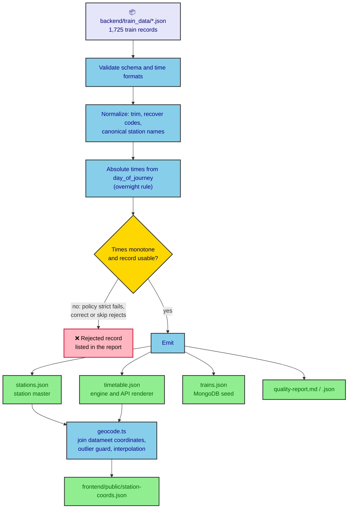

---

## Temporal model

All times are naive IST minutes (India has no DST).

**Overnight rule, the key data finding.** `day_of_journey` (doj) is the day of the **departure** from a
stop. So:

```
dep_abs = (doj − 1)·1440 + dep_hhmm
arr_abs = (doj − 1)·1440 + arr_hhmm − (arr_hhmm > dep_hhmm ? 1440 : 0)    // arrived before midnight, left after
at the terminus (no departure), doj applies to the arrival
```

Example: KUR arrives 23:45 and departs 00:05 with doj = 2, so it arrives on day 1 and departs on day 2.
With this rule, all 30,796 stops are monotone (0 violations). The common "add a day whenever the clock
wraps" unrolling is **wrong** for this data, giving 1,072 mismatches, because some consecutive listed stops
are more than 24 h apart (the longest hop is 3,512 min).

**Operating days** refer to the train's **start date** (doj 1). A train instance exists on date D iff
`operating_days[weekday(D)]`. For a query on date Q, instances that started on Q−3 … Q+4 are considered.
This covers trains already en route on Q and journeys that continue for several days.

---

## Problem formulation

- A **train instance** is (train, start date) for each operating start date.
- A **leg** is (instance, board stop i, alight stop j) with i < j, where both stops are real stations and
  have different codes.
- A **journey** J = (L₁ … Lₙ) satisfies:
  - L₁ boards at the source and Lₙ alights at the destination.
  - Lₖ₊₁ boards at the station where Lₖ alighted.
  - `dep(Lₖ₊₁) ≥ arr(Lₖ) + 30`. The minimum transfer time is configurable and must be at least 1.
  - The first departure lies in `[Q + time, Q 23:59]`. Later legs may be on any day.
  - **No station is touched twice**, including stations ridden through without stopping. This rules out
    A→B→A and back-and-forth routes.
  - Each train number is used at most once.
  - n − 1 ≤ `MAX_TRANSFERS_INTERNAL` (10).
  - Arrival ≤ Q + time + horizon (4 days by default).
- **Ranking** is lexicographic by (arrival, −first departure, transfers, total transfer waiting,
  signature). Among journeys that arrive at the same time, the one that leaves later, then the one with
  fewer transfers, then the one with less waiting wins.
- **Uniqueness**: the signature is `train:FROM>TO|…` with no dates. The same itinerary on a later day is a
  duplicate, and only its earliest (best-ranked) occurrence is kept.
- **Dominance** (exact, see below): a journey is dropped when a strictly better journey exists that does
  not change trains needlessly.

Output: the top K = 50 journeys (`TOP_K`), or fewer if fewer exist.

---

## Routing algorithm

Why not the textbook algorithms:

- **Dijkstra, CSA and RAPTOR** compute one earliest arrival, or a Pareto set over (arrival, transfers).
  They cannot produce the K best distinct journeys.
- **Yen's K-shortest paths on a time-expanded graph** needs a graph with about 60k event nodes per day and
  K rounds of spur searches, each a full shortest-path run. That is too slow for interactive use, and the
  "no repeated station" rule does not map cleanly to Yen's node removals.

The engine combines an exact **backward profile** with **best-first K-best enumeration**:

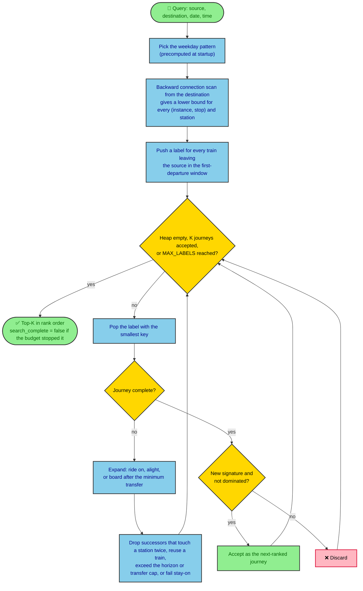

### 1. Per-weekday precomputed patterns (at startup)

For each of the 7 weekdays, the engine precomputes:

- The train instances relevant to a query on that weekday, with start-day offsets relative to the query
  date.
- All their elementary connections (stop i → i+1), pre-sorted by departure time, descending.

Times are stored relative to 00:00 of the query date, so one structure serves every date with that
weekday. There is no per-query sorting, and query setup takes about 0.2 ms.

### 2. Backward Connection-Scan profile (per query, O(C))

One scan over the connections, from the destination, restricted to [query time, query time + horizon],
computes:

- `T[inst][stop]`: the exact earliest arrival at the destination for a passenger on board `inst` at `stop`.
  The value is lexicographic: (arrival, remaining transfers).
- A step function per station: the earliest arrival at the destination when standing at station s from
  time t, respecting the 30-min transfer rule.

The profile relaxes the loop, train-reuse and transfer-cap rules, so its values are **lower bounds** on
what any valid continuation can achieve.

### 3. Best-first (A\*) K-best enumeration

Labels are partial journeys: `Root`, `Onboard(inst, stop)` and `AtStation(station, time)`, stored in an
arena with parent pointers. The priority key is

```
(arrival lower bound from the profile, −first departure, transfer lower bound, waiting, label id)
```

- From the source, every instance departing in the first-departure window is boarded.
- **On board**, the passenger can ride to the next stop, or alight at the current one.
- **At a station** at time a, the passenger can board any instance departing at ≥ a + 30. The engine
  finds these with a binary search in the station's departure index.
- The parent chain is per leg, so checking "station already touched" walks at most about 11 legs. It
  uses a 64-bit bloom filter plus `train_calls_at` binary searches.
- A label whose bound is infinite, exceeds the horizon, or exceeds the transfer cap is never created.

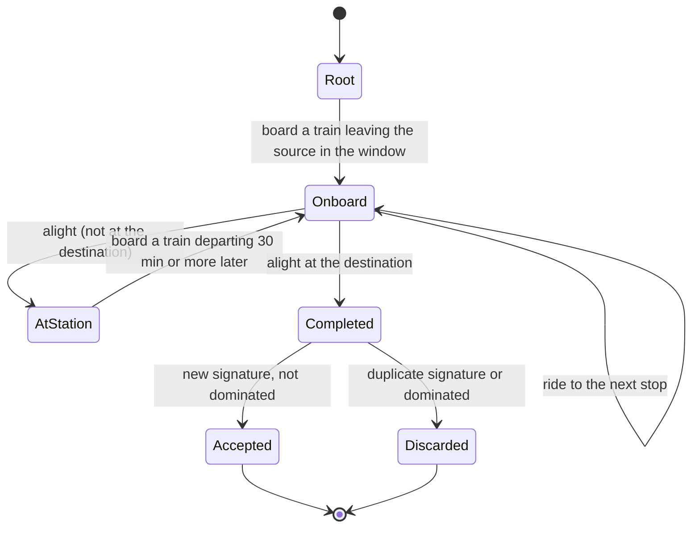

When a completed journey is popped, it is final (see Correctness). It is dropped if its signature was
already emitted or if a dominance rule applies. The search stops after K accepted completions.

### 4. Dominance rules (exact)

These rules only remove a journey J when a **strictly better valid** journey J′ is guaranteed to exist.
J′ arrives no later, departs no earlier, has fewer transfers and is loop-free, so the top-K never contains
pointless train changes:

- **Stay-on** (applied during the search): J alights from train X, but X itself reaches the destination
  without touching J's earlier stations. Then J must arrive strictly earlier than X, or it is dropped.
  A generalized version runs on completion: X reaches the alighting station of a later leg of J.
- **Board-earlier** (checked on completion only): J boards an instance that was already boardable at an
  earlier point where the passenger stood (the source or an earlier transfer station). J′ boards it there
  instead. Doing this check during the search was shown to be unsound; the regression test is the JHN→DUMK
  case. So it runs only on completed journeys, where J′ can be verified to be loop-free.

A "prefix dominance" rule was prototyped and removed: it conflicts with the user-side filters, and it
brought no speedup once the profile bound was in place.

### 5. Budgets

- `MAX_LABELS` (default 500,000) is a deterministic per-query work budget. Completed journeys are still
  popped in exact rank order, so hitting the budget never returns a wrong or misordered journey. It can
  only return **fewer than K**, and it reports `search_complete: false`. At K = 50 this happens for
  about 2.4 % of random queries (it was 1.5 % at K = 20 with a 200,000 budget; keeping 200,000 at K = 50
  would raise it to about 4.4 %).
- `K_NODE` (default 0 = off) optionally caps labels per train event. It is a heuristic: when it is
  enabled, the result is no longer guaranteed to be the exact top-K.

---

## Correctness

| Claim | Argument |
|---|---|
| Bound is admissible | The profile solves a relaxation (no loop, train-reuse or transfer-cap rules) over the same connections and the same 30-min rule, so its value ≤ the arrival of any valid completion |
| Bound is consistent, and keys are monotone | Extending a label (ride, alight, transfer and board) can only restrict options, so the bound never decreases along a path. The tie-break components are fixed once the first leg is chosen (first departure) or only grow (transfers, waiting) |
| Completions are popped in exact rank order | A* with a consistent key: when a completed journey is popped, every unexplored label has key ≥ its key, so nothing better can appear later |
| Transfer rule | Boarding at a station requires `dep ≥ arr + min_transfer`. Staying on the same train is not a transfer |
| Operating days and overnight | Instances are only generated for operating start dates, and absolute times come from the doj rule above (validated as 0 monotonicity violations on the full dataset) |
| Uniqueness | Signatures are compared in rank order, and the first occurrence is kept |
| Dominance soundness | Each rule constructs J′ explicitly and checks it is valid and strictly better. Board-earlier is applied only on completion, where this check is exact |
| Budget | It truncates the output list and never reorders it |

These claims are verified by tests (see [Testing](#testing)), including exact equality against a
brute-force enumerator on about 22,700 random small networks.

---

## Complexity

With C ≈ 130k connections in a query's horizon, L = labels created, and d = departures per station:

- Startup: O(C log C) once per weekday pattern. Loading plus pattern building takes about 100–360 ms.
- Profile: O(C) per query.
- Search: O(L log L) for the heap, plus O(log d) per boarding lookup. The loop check per label is O(legs)
  ≤ 11. The exact bound keeps L small: about 3.5k labels at the median and 22k at p90, capped by `MAX_LABELS`.
- Memory: timetable plus patterns about 100 MB resident. Per query O(C + L), using thread-local arenas.

---

## API

Base: `/api` (through the frontend proxy, or directly on the API at `:4000`).

### `GET /health` (also `/api/health`)

Returns 200 when healthy and 503 otherwise:

```json
{ "status": "healthy",
  "checks": { "engine": "up", "stations": { "count": 2894, "source": "mongodb" }, "mongo": "connected" },
  "engine": { "load_ms": 364, "requests": 0, "config": { "min_transfer_minutes": 30, "top_k": 50, "...": "..." } } }
```

### `GET /api/stations?q=<prefix>&limit=10`

Prefix search on station code and on any known name. Ranking: exact code, then code prefix, then name
prefix, then by `train_count`.

```json
{ "query": "ndl", "stations": [ { "code": "NDLS", "name": "NEW DELHI", "label": "NEW DELHI (NDLS)", "train_count": 118 } ] }
```

`GET /api/stations/:code` returns a single station, or 404.

### `POST /api/routes`

```json
{ "source": "BD", "destination": "NDLS", "date": "2026-09-25", "time": "10:00",
  "limit": 5, "page": 1,
  "filters": { "max_duration_minutes": 2000, "max_transfers": 2, "direct_only": false } }
```

The schema is strict: unknown fields are rejected. `limit` is 1–`MAX_RESULTS` (default and maximum 50). `max_duration_minutes`
is ≤ 3000.

Response:

```jsonc
{
  "query": { "source": "BD", "destination": "NDLS", "source_name": "BADNERA JN.", "destination_name": "NEW DELHI",
             "date": "2026-09-25", "time": "10:00", "search_datetime": "2026-09-25T10:00:00" },
  "routes": [{
    "rank": 1, "id": "01211:BD>AK|22894:AK>BSL|12534:BSL>BPL|12723:BPL>NDLS|",
    "source": { "code": "BD", "name": "BADNERA JN." }, "destination": { "code": "NDLS", "name": "NEW DELHI" },
    "departure_datetime": "2026-09-25T10:05:00", "arrival_datetime": "2026-09-26T08:00:00",
    "duration_minutes": 1315, "total_elapsed_duration_minutes": 1320, "initial_wait_minutes": 5,
    "train_travel_minutes": 1152, "waiting_minutes": 163,
    "transfer_count": 3, "segment_count": 4, "is_direct": false, "distance_km": 1318,
    "train_numbers": ["01211", "22894", "12534", "12723"],
    "segments": [{
      "train_number": "01211", "train_name": "BD-NK SPL", "train_type": "TRAIN ON DEMAND", "train_start_date": "2026-09-25",
      "from_station": { "code": "BD", "name": "BADNERA JN." }, "to_station": { "code": "AK", "name": "AKOLA JN." },
      "departure_datetime": "2026-09-25T10:05:00", "arrival_datetime": "2026-09-25T11:02:00",
      "duration_minutes": 57, "distance_km": 79, "stop_count": 3,
      "stops": [
        { "code": "BD",  "name": "BADNERA JN.",    "arrival_datetime": null, "departure_datetime": "2026-09-25T10:05:00", "distance_km": 0,  "boardable": true },
        { "code": "MZR", "name": "MURTAJAPUR JN.", "arrival_datetime": "2026-09-25T10:30:00", "departure_datetime": "2026-09-25T10:32:00", "distance_km": 41, "boardable": true }
        // ...
      ] }
      // ... 3 more segments
    ],
    "transfers": [
      { "station": { "code": "AK", "name": "AKOLA JN." }, "arrival_datetime": "2026-09-25T11:02:00", "departure_datetime": "2026-09-25T12:15:00", "wait_minutes": 73 }
      // ...
    ]
  }],
  "filters_applied": {},
  "pagination": { "page": 1, "limit": 5, "returned": 5, "total_available": 50, "total_unfiltered": 50, "total_pages": 10, "max_results": 50 },
  "meta": { "cached": false, "search_complete": true, "engine_ms": 10.2, "api_ms": 21.4 }
}
```

The engine always computes the full top-50 once. That result is cached, and `limit`, `page` and `filters`
only slice it, so paging or toggling filters never triggers a second routing run. Ranks refer to the
unfiltered ranking, so they stay stable while filters change.

| Case | Status | Body |
|---|---|---|
| Bad field, format or unknown key | 400 | `error.code = VALIDATION_ERROR`, with details |
| Unknown station code, or source = destination | 400 | `UNKNOWN_STATION` / `VALIDATION_ERROR` |
| Malformed JSON | 400 | `INVALID_JSON` |
| No route | 200 | `routes: []`, `message: "No valid journey found for the specified date and time."` |
| Filters exclude everything | 200 | `routes: []`, `message: "No journey matches the selected filters."` |
| Engine down or timed out | 503 | `ENGINE_UNAVAILABLE` |
| More requests waiting than `MAX_QUEUE` allows | 429 | `OVERLOADED`, with `retry-after: 1` |

`meta.worker` names the engine worker that computed the result (null on a cache hit).

A search from the browser to the engine and back:

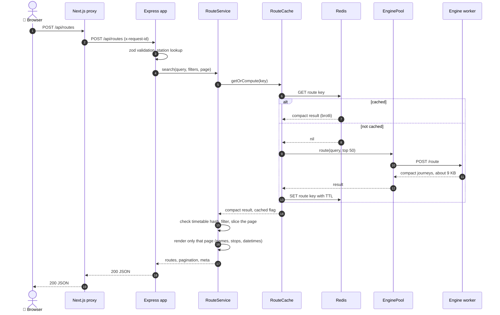

### API internals

`src/bootstrap.ts` wires the same services for the API process and the cache-warmer, so both build the same
cache keys:

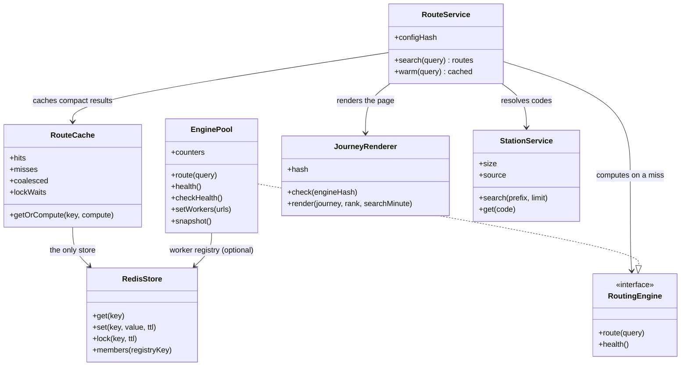

- **Compact engine results, rendered in the API**: the engine returns each journey as
  `[train_idx, board_stop, alight_stop, start_day]` legs plus absolute minutes (about 9 KB for 50 journeys,
  instead of about 260 KB fully rendered). `src/services/journeyRenderer.ts` loads the same
  `timetable.json` (`TIMETABLE_PATH`), rebuilds the engine's train list, and renders only the page being
  returned: names, every intermediate stop, datetimes, distances (float32, as in the engine). Filters run on
  the compact journeys first. Both sides hash the timetable file (FNV-1a 64); the API refuses to start, or to
  render a result, when the engine's hash differs. A parity test checks the renderer against the engine's
  former full output (`api/test/fixtures/render-parity.json.gz`; 780 queries / 25,896 journeys were
  compared before the full format was removed).
- **Route cache**: Redis only (nothing is cached in API memory), shared by every API process. Values are the
  compact engine results, brotli-compressed, with a TTL. The key is
  `src|dst|date|time|engine-config+timetable-hash`, so a new timetable never serves stale entries.
  Concurrent identical queries in one process share one engine call (in-flight coalescing). Redis errors
  fail open: the search is computed and not cached.
- **Cache-warmer**: a one-shot service (`node src/warmer.ts`, same image as the API) that runs on every
  `docker compose up`. It waits for Redis and the engine, computes the busiest `PREWARM_PAIRS` station pairs
  at every hour of today (the frontend's default time is the current hour, and the current hour goes first)
  with `PREWARM_CONCURRENCY` searches at a time, logs its stats and exits. A Redis lock lets one warmer run at
  a time; entries already in Redis are skipped, so re-running it is cheap (`docker compose up cache-warmer`).
  With several API processes, an optional Redis lock (`REDIS_LOCK_MS`) makes the other processes wait for
  the one that is already computing a key:

  ```mermaid
  sequenceDiagram
      participant A as Request A
      participant B as Request B (same query)
      participant C as RouteCache
      participant R as Redis
      participant P as EnginePool

      A->>C: getOrCompute(key)
      C->>R: GET key
      R-->>C: nil
      opt REDIS_LOCK_MS > 0
          C->>R: SET lock NX PX
          R-->>C: acquired (otherwise poll GET until the value appears)
      end
      C->>P: route(query)
      B->>C: getOrCompute(key)
      Note over B,C: same process: B shares A's pending promise (coalesced)
      P-->>C: result
      C->>R: SET key (brotli, TTL)
      C-->>A: value, cached = false
      C-->>B: value, cached = false
      Note over C,R: any Redis error is counted and ignored (fail open)
  ```
- **Engine pool** (`src/services/enginePool.ts`): dispatches each search to one of the engine workers. One
  worker is simply a pool of one. Keep-alive `fetch`, a timeout that covers queueing, retries and hedges, and
  a FIFO semaphore per worker (`ENGINE_CONCURRENCY`). The semaphore matters because cpp-httplib holds a
  worker thread for each open keep-alive connection. Without it, a burst opens more sockets than the engine
  has threads, and the extra requests stall for the 5 s keep-alive timeout. This was found by the load
  test. See [Scaling architecture](#scaling-architecture).
- **Filters**: a registry in `src/services/filters.ts`. A new filter is one entry: a schema field plus a
  predicate.
- **Logging**: structured pino JSON with a per-request `req_id`, which is propagated from the frontend
  proxy.

---

## Frontend

Next.js App Router. `app/page.tsx` is a client component. Its URL state (`?from&to&date&time` plus the
filters and sort, e.g. `&via=NGP&vmode=must&sort=duration`) makes searches shareable and supports the
back button.

- `components/StationPicker`: debounced autocomplete against `/api/stations`, with keyboard navigation.
- `components/SearchForm`: stations, a swap button, date (with Today / Tomorrow shortcuts) and time.
- `components/JourneyCard`: summary (departure → arrival, duration, a to-scale bar of train legs and
  waits, train chips), and on expand a vertical timeline per segment with transfer waits, "+1 day" badges
  on times after the search date, expandable intermediate stops, and "Exclude train".
- `components/SummaryStrip`: best-in-class tiles (earliest arrival, shortest trip, fewest changes, least
  waiting) over the filtered list; a click selects that journey. `components/SortBar` reorders the top 50
  by the same keys; the engine rank stays visible as `#n`.
- `components/FilterBar`: a one-row bar above the list. Every predicate lives in a registry in
  `lib/filters.ts`: direct only, maximum changes, minimum time to change trains, longest single wait, and
  excluded trains (added from a card).

  The frontend fetches the top 50 once (`MAX_RESULTS` in `lib/api.ts`), then filters, sorts and
  paginates (10 per page) on the client with no extra requests. Filters only narrow the top 50; they do not search for journeys outside it.
- `components/RouteMap` (Leaflet, loaded client-side only through `MapPanel`): the selected journey is
  drawn as a smoothed line through every stop of every leg, one colour per leg (matching the card), with
  a casing, an animated dash in the direction of travel, ringed halting stops, two-colour transfer
  markers and stop tooltips; the other journeys are faint dotted lines, and hovering a card or a line
  lifts it. Before a search it pins the picked stations. Tiles are Esri's keyless grey canvas
  (light and dark variants), the only external request.
- **Station coordinates** come from the [datameet/railways](https://github.com/datameet/railways)
  station list (CC0, vendored at `data/external/datameet-stations.json`). `scripts/geocode.ts` joins it
  by code (plus a few hand-checked aliases for recoded stations such as CSMT and MMCT), rejects points
  that disagree with the timetable's own distances, and fills the gaps by interpolating along train
  routes by `distance_km`. 2,859 of 2,894 stations (98.8 %) are resolved; the map draws straight past the
  rest. Details are in `data/reports/geocode-report.md`. The output, `frontend/public/station-coords.json`
  (about 68 KB), is committed and served statically, so the map never waits on the API.
- `app/api/[...path]/route.ts`: a same-origin runtime proxy to `API_INTERNAL_URL`. The browser never talks
  to the API directly (no CORS setup is needed), and one image works in every environment.
- Layout: two equal columns (list and a sticky map) from 1024 px; below that a floating List / Map switch
  replaces the map column.
- Supports dark mode via `prefers-color-scheme`, including the map tiles. The standalone output is the
  Docker runtime image.

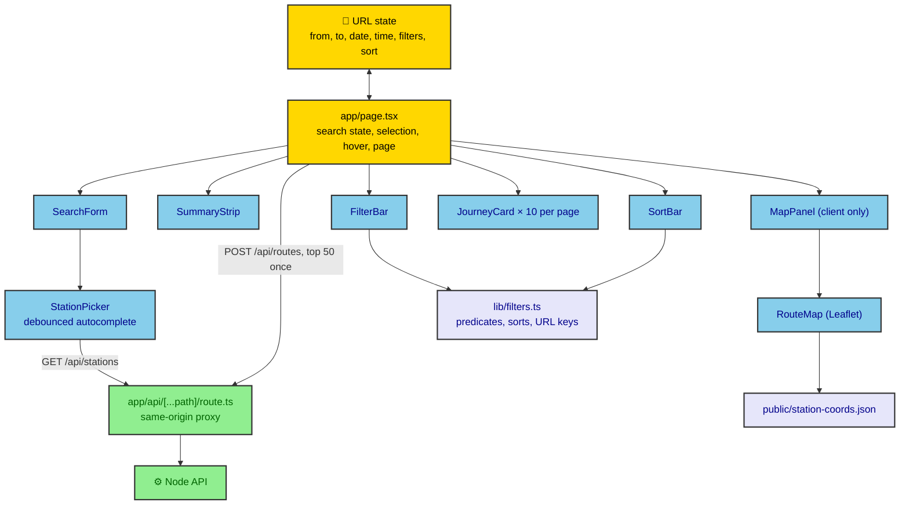

---

## MongoDB schema

Database `railway` (`MONGODB_DB`). The one-shot `seed` service (`npm run seed`) upserts the normalized data
and removes stale documents, so it can be re-run safely.

| Collection | Document | Indexes |
|---|---|---|
| `stations` | `{ code, name, all_known_names[], train_count, updated_at }` | `code` unique, `name`, `train_count` |
| `trains` | `{ number, name, type, route_id, operating_days, classes_available, stops[{ code, name, seq, arr, dep, day, distance_km }], … }` | `number` unique, `stops.code`, `type` |
| `ingest_reports` | `{ generated_at, raw, cleaned, issue_counts }` | `generated_at` |

The collections are not linked by foreign keys; a train's stops embed the station code:

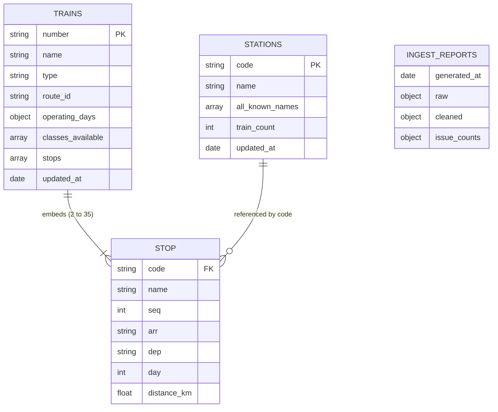

At boot, the API loads the station master from Mongo into memory (a sorted array for prefix search). If
Mongo is unavailable or empty, it falls back to `stations.json`. Routing reads only the engine's
in-memory timetable.

---

## Scaling architecture

The engine is stateless after it has loaded the timetable, so it scales by running more copies. In the
distributed setup each engine is a **worker**: one process pinned to one vCPU. The Node API stays the only
place that handles requests, and its `EnginePool` spreads the searches over the workers. Everything below
is switched by environment variables; with one `ENGINE_URL` and the defaults, it behaves as the
single-engine app.

### Workers

- `WORKER_ID` names the worker in its logs, in `/health`, and in every `/route` answer (`meta.worker` in
  the API response).
- `GET /metrics` serves Prometheus text with no extra dependency (`src/metrics.h`, a lock-free histogram):
  requests by outcome, in-flight searches, budget hits, labels popped, response bytes, search time.
- `/health` and `/metrics` are also served on `ADMIN_PORT` (7071) by a separate two-thread listener, so
  health checks and scrapes never occupy a routing thread.
- Every `/route` answer carries `X-Inflight`, the number of other searches running on that worker.
- **Graceful drain**: on SIGTERM, `/health` answers 503 `draining` for `SHUTDOWN_GRACE_MS` while `/route`
  keeps serving, then the listener stops, in-flight searches finish and the process exits 0.

### Dispatch (`api/src/services/enginePool.ts`)

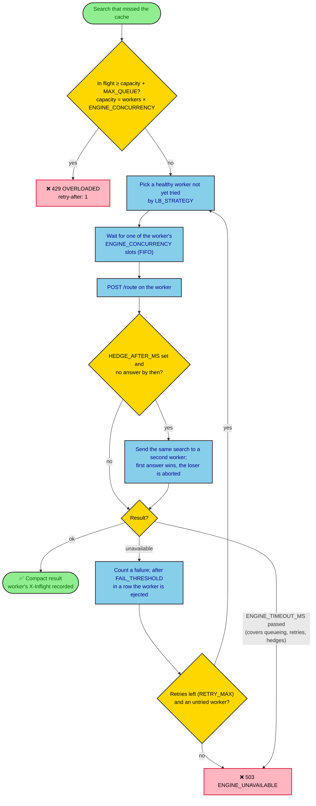

Load-balancing strategies (`LB_STRATEGY`):

| Strategy | Picks |
|---|---|
| `round_robin` | The next worker in the list; ejected workers are skipped without shifting the order |
| `random` | A random healthy worker |
| `least_outstanding` | The worker with the fewest of this process's requests in flight or queued; ties rotate |
| `p2c` | The less loaded of two random workers |
| `consistent_hash` | A hash ring (100 virtual nodes per worker) keyed on `source\|destination` |
| `least_reported` | `least_outstanding` plus the load each worker last reported (`X-Inflight`, `in_flight` in `/health`), decayed over `LB_REPORT_DECAY_MS`, so several API processes see each other's requests |

Health and membership:

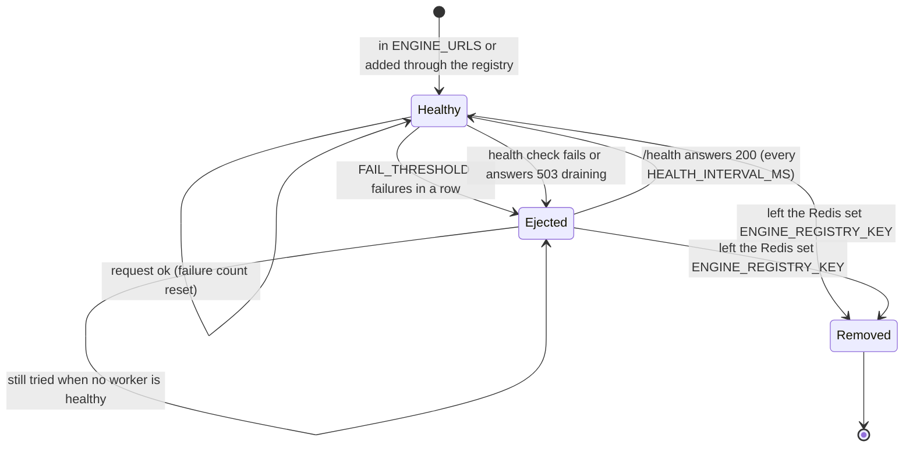

- Health checks go to the worker's admin port on a fresh connection (no parked keep-alive thread), and
  resolve host names with c-ares, because `getaddrinfo` for a stopped container blocks a libuv thread for
  about 5 s.
- With `ENGINE_REGISTRY_KEY` set, each API process re-reads that Redis set every second and calls
  `setWorkers()`, so workers can join and leave without an API restart.
- `MAX_QUEUE=auto` (the default) allows one extra capacity of waiting requests, recomputed as membership
  changes; `-1` is unlimited; a number is a fixed cap.

### API tier

- `NODE_CLUSTER=n` forks n API processes that share the port (`api/src/server.ts`); the primary restarts a
  process that dies and serves the summed Prometheus metrics. Each process has its own pool, so a worker
  can receive up to n × `ENGINE_CONCURRENCY` requests at once and needs at least that many
  `ENGINE_THREADS`.
- Several API hosts sit behind nginx (`loadtest/nginx/gateway.conf.template`: upstream keep-alive,
  optional gzip).
- Metrics (`api/src/metrics.ts`, prom-client on `METRICS_PORT`): the HTTP latency histogram, pool events
  (retry, hedge, hedge win, rejected), per-worker outstanding, health, requests and errors, and cache
  outcomes.
- The cache is shared through Redis, and the cache key includes the engines' configuration and timetable
  hash, so every process and host reads and writes the same entries.

---

## Configuration

All settings come from environment variables. See `.env.example`.

| Service | Variable | Default | Meaning |
|---|---|---|---|
| engine | `TIMETABLE_PATH` | `/data/timetable.json` | Preprocessed timetable |
| | `ENGINE_HOST` / `ENGINE_PORT` | `0.0.0.0` / `7070` | |
| | `ENGINE_THREADS` | 8 | HTTP routing threads. One is held per open keep-alive connection, so keep it at least the API's `ENGINE_CONCURRENCY` × API processes |
| | `ADMIN_PORT` | 7071 | Separate two-thread listener for `/health` and `/metrics` (0 = off) |
| | `SHUTDOWN_GRACE_MS` | 3000 | On SIGTERM, `/health` returns 503 `draining` for this long, then in-flight searches finish and the engine exits |
| | `MIN_TRANSFER_MINUTES` | 30 | Minimum transfer time (≥ 1) |
| | `MAX_TRANSFERS_INTERNAL` | 10 | Transfer cap |
| | `TOP_K` | 50 | Results computed (compose sets it explicitly; keep it equal to the API's `MAX_RESULTS`) |
| | `SEARCH_HORIZON_MINUTES` | 5760 | Arrival must fall within this window |
| | `MAX_LABELS` | 500000 | Deterministic work budget per query (about 24 MB of labels per engine thread at the limit) |
| | `K_NODE` | 0 | Heuristic per-event cap (0 = exact) |
| | `PRUNE_STAY_ON` / `PRUNE_BOARD_EARLIER` | 1 / 1 | Dominance rules |
| | `WORKER_ID` | `engine` | Name of this worker in logs, `/health`, metrics and answers |
| api | `API_PORT`, `API_HOST` | 4000, `0.0.0.0` | |
| | `ENGINE_URLS` / `ENGINE_URL` | `http://127.0.0.1:7070` | Comma-separated list of engine workers, or a single one |
| | `ENGINE_TIMEOUT_MS` | 5000 | Includes queueing, retries and hedges |
| | `ENGINE_CONCURRENCY` | 4 | Maximum in-flight engine calls per worker, per API process |
| | `LB_STRATEGY` | `round_robin` | `round_robin`, `random`, `least_outstanding`, `p2c`, `consistent_hash`, `least_reported` |
| | `LB_REPORT_DECAY_MS` | 500 | `least_reported`: time constant of a worker's reported load |
| | `RETRY_MAX` | 1 | Extra attempts on another worker after an "unavailable" failure |
| | `HEDGE_AFTER_MS` | 0 | Send a second copy to another worker after this long (0 = off) |
| | `MAX_QUEUE` | `auto` | Requests allowed to wait beyond capacity before 429: `auto` = one capacity, `-1` = unlimited, or a number |
| | `FAIL_THRESHOLD`, `HEALTH_INTERVAL_MS` | 3, 2000 | Failures in a row before ejection; active health-check period (0 = off) |
| | `ENGINE_REGISTRY_KEY` | unset | Redis set of worker URLs; when set, the pool follows it |
| | `NODE_CLUSTER` | 1 | API processes sharing the port |
| | `METRICS_PORT` | 9464 | Prometheus metrics listener (0 = off) |
| | `CACHE_COALESCE`, `REDIS_LOCK_MS`, `REDIS_TIMEOUT_MS` | true, 0, 50 | In-process coalescing; cross-process lock (0 = off); Redis command timeout |
| | `MAX_RESULTS` | 50 | Journeys computed per search and the maximum `limit`; the engine's `TOP_K` must be at least this |
| | `MONGODB_URI`, `MONGODB_DB` | unset, `railway` | Mongo is optional outside Docker |
| | `STATIONS_FILE` | `data/processed/stations.json` | Fallback station master |
| | `TIMETABLE_PATH` | `data/processed/timetable.json` (image: `/app/data/processed/timetable.json`) | Timetable used to render journeys; must be the engines' file |
| | `CACHE_ENABLED`, `CACHE_BACKEND`, `REDIS_URL`, `CACHE_TTL_SECONDS` | true, redis, (compose), 3600 | Redis only; a few KB per compressed entry |
| cache-warmer | `PREWARM_PAIRS`, `PREWARM_TIMES`, `PREWARM_DAYS`, `PREWARM_TZ`, `PREWARM_CONCURRENCY`, `PREWARM_TTL_SECONDS`, `PREWARM_FILE` | 50, hourly, 1, Asia/Kolkata, 2, (days+1)×86400, none | What the warmer computes (plus the API's engine/Redis/Mongo variables) |
| | `WARMER_WAIT_MS`, `PREWARM_LOCK_MS` | 120000, 600000 | How long to wait for Redis and the engine; warmer lock TTL |
| | `CORS_ORIGIN`, `LOG_LEVEL` | unset, `info` | |
| frontend | `API_INTERNAL_URL` | `http://127.0.0.1:4000` | Proxy target |
| compose | `PUBLIC_PORT` | 80 | Published frontend port |
| | `MONGO_ROOT_USER`, `MONGO_ROOT_PASSWORD` | (required) | Use a URL-safe password: it is embedded in the Mongo URI |

The AWS study stack has its own knobs (worker count and placement, API hosts, gzip, prewarm, and the
variables above). They are listed with comments in `deploy/variants/defaults.env`; its defaults differ in a
few places (`LB_STRATEGY=least_outstanding`, `ENGINE_CONCURRENCY=2`, `LOG_LEVEL=warn`).

---

## Deployment

### Docker Compose

`docker-compose.yml` (project `railway-routing`) defines:

- `mongo`: `mongo:8`, a named volume, and a `mongosh` ping healthcheck.
- `engine`: a multi-stage build. Stage 1 preprocesses the raw data, stage 2 compiles **and runs
  `engine_tests`** (so a failing test fails the image build), and stage 3 is a slim Debian runtime with a
  non-root user.
- `redis`: `redis:7-alpine`, the route cache. No persistence, `REDIS_MAXMEMORY` (256mb) with LRU eviction.
- `seed`: a one-shot job using the API image. It runs after Mongo is healthy.
- `api`: starts after the engine and Redis are healthy and the seed has completed successfully. Node 24 Alpine,
  non-root.
- `frontend`: the Next.js standalone server. It is the only published port.
- Networks: `backend` (mongo, redis, engine, api) and `frontend` (api, frontend).
- `cache-warmer`: a one-shot job using the API image; it exits 0 when the cache is filled.
- Every long-running service has a healthcheck, `restart: unless-stopped`, and rotated json-file logs
  (10 MB × 5).

Start-up order (`depends_on` conditions):

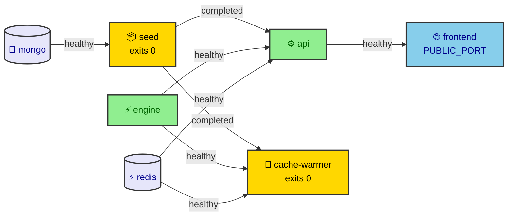

### AWS EC2

1. Launch Ubuntu 24.04 on **t3.small or larger** (2 vCPU, 2 GB RAM; t3.medium gives headroom for the
   route cache). Use a 20 GB gp3 disk.
2. Security group: inbound 22 (your IP only), 80 and 443. Nothing else: Mongo, the engine and the API
   are not published.
3. Install Docker:
   ```bash
   curl -fsSL https://get.docker.com | sh && sudo usermod -aG docker $USER   # then log out and back in
   ```
4. Deploy:
   ```bash
   git clone <repo> railway && cd railway
   cp .env.example .env && sed -i "s/^MONGO_ROOT_PASSWORD=.*/MONGO_ROOT_PASSWORD=$(openssl rand -hex 24)/" .env
   docker compose up -d --build
   ```
5. **TLS (recommended):** set `PUBLIC_PORT=8080`, then put Caddy in front of it. Caddy obtains
   certificates automatically:
   ```
   # /etc/caddy/Caddyfile
   rail.example.com {
     reverse_proxy 127.0.0.1:8080
   }
   ```
   Alternatively, add Caddy as a fourth compose service on the `frontend` network. nginx with certbot
   works the same way.
6. Updates: `git pull && docker compose up -d --build`. The seed re-runs idempotently.
   Logs: `docker compose logs -f api engine`.

### AWS, distributed (the study stack)

The 10-host deployment with separate engine workers is provisioned with Terraform and deployed with the
scripts in `deploy/`. It is described under [Scaling study](#scaling-study-on-aws) and, step by step, in
[`deploy/README.md`](deploy/README.md).

---

## Benchmarks

Machine: 12-core x86-64 Linux, Docker Engine 29. Queries are uniformly random station pairs and times
on 2026-09-25, and about 70 % of the pairs have at least one route.

### Engine only (`routing-engine/build/bench`, 1000 queries, single thread)

| Metric | Value |
|---|---|
| Timetable load + pattern build | 100–360 ms (364 ms inside Docker) |
| p50 / p90 / p95 / p99 / max, K = 50, budget 500k | 7.5 / 28.3 / 59.6 / 201 / 267 ms |
| Budget hit (`search_complete=false`), K = 50 | 2.4 % of queries |
| BD → NDLS, 2026-09-25 10:00, K = 50 | 50 routes in ~15 ms |
| For reference, K = 20, budget 200k | p50 / p90 / p95 / p99 7.3 / 15.6 / 23.5 / ~100 ms; 1.5 % budget hits |

The end-to-end numbers below were measured at K = 20; at K = 50 the response is about 2.5 times larger,
and BD → NDLS measured `api_ms` 41 uncached through the proxy.

### End to end (`npm run bench` in `api/`, autocannon, 20 s runs)

The API is benchmarked from a container on the compose network. The public path goes through the Next.js
proxy on `PUBLIC_PORT`.

| Scenario | Throughput | Client p50 / p90 / p99 | Server engine_ms p50 / p99 | Server api_ms p50 / p99 |
|---|---|---|---|---|
| API direct, cold (every query unique), 1 connection | ~33 req/s | 26 / 44 / 105 ms | 8.0 / 90 ms | 21 / 101 ms |
| API direct, cached, 10 connections | ~300 req/s | 27 / 51 / 92 ms | none (cache hits) | 0.15 / 0.5 ms |
| Public path (Next proxy), cold, 1 connection | ~20 req/s | 45 / 71 / 207 ms | 10.2 / 177 ms | 28 / 191 ms |
| Public path, cold, 10 connections | ~68 req/s | 138 / 200 / 289 ms | 13.0 / 110 ms | 75 / 227 ms |
| Public path, cached, 10 connections | ~113 req/s | 83 / 114 / 143 ms | none | 0.15 / 0.6 ms |

Where the time goes for a cold request (medians):

| Stage | Time |
|---|---|
| Routing (profile + search) | ~8 ms |
| Engine JSON serialization (nlohmann, about 100 KB for 20 routes with all stops) | ~6 ms |
| API: parse the engine response, shape it, and serialize | ~7 ms |
| Next.js proxy hop | ~20 ms |

These tables were measured when the engine still rendered full journeys. Since then the engine writes a
compact result (about 8.8 KB instead of about 257 KB at K = 50) with plain string appends, and the API
renders only the returned page. On the local 4-worker rehearsal stack this moved the point where p99
crosses 500 ms from about 58 to about 108 requests per second, and the median API overhead
(`api_ms − engine_ms`) from 35–40 ms to about 19 ms. Those are laptop figures; the AWS measurements are in
the [load-test report](docs/load-test-report.md).

At 10 connections, `api_ms` includes queueing for the 4 engine slots, which is intentional backpressure.

Two issues were found and fixed by the load test:

1. **Five-second stalls.** cpp-httplib dedicates a thread to each keep-alive connection. With 4 engine
   threads and 10 API sockets, requests stalled until keep-alive expired, which caused 15 × 503 errors in
   20 s and a 5 s p99. The fix is the API-side `ENGINE_CONCURRENCY` semaphore plus 8 engine threads. After
   the fix there were 0 errors.
2. **Nagle + delayed ACK.** httplib writes headers and body separately. Enabling `TCP_NODELAY` cut API
   p50 from 34 to 21 ms.

Reproduce:

```bash
cd api && npm run bench -- --mode cold --connections 10 --duration 20 --url http://localhost:8080
#   --mode cached   warms 50 queries, then replays them
```

---

## Load testing

`loadtest/` holds everything needed to load the distributed setup, locally or on AWS. k6 never goes
through Next.js: the path is k6 → nginx → Node API → workers.

**Workloads** (`loadtest/k6/lib/queries.js`, data in `loadtest/data/queries.json`). All are deterministic
for a given `SEED`, so repeats send the same queries:

| `WORKLOAD` | Queries |
|---|---|
| `uniform` | Random station pairs and times, every request distinct (about 70 % have a route). `HEAVY_FRAC` mixes in a share of the slowest queries |
| `zipf` | 2,000 queries among the 150 busiest stations, popularity skewed by `ZIPF_S` |
| `heavy` | The slowest 2 % of a 4,000-query engine benchmark (154–586 ms each) |
| `session` | Station autocomplete, a search, then page 2 |

**Scenarios** (`loadtest/k6/scenarios/`):

| Scenario | k6 executor | Use |
|---|---|---|
| `smoke` | 20 shared iterations | Must pass with 0 errors before every measured run |
| `load` | `constant-arrival-rate` | Fixed open-loop rate |
| `breakpoint` | `ramping-arrival-rate` | Ramp until the SLO breaks; k6 aborts on its thresholds |
| `spike` | `ramping-arrival-rate` | Base rate, a short spike, back to base |
| `soak` | `constant-arrival-rate` | Long run for drift |
| `closed` | `constant-vus` | Closed loop, for the methodology comparison |

The SLO used throughout is **p99 < 500 ms and errors < 0.1 %** at the client. k6 also reports custom
metrics taken from the API's `meta` block (`route_engine_ms`, `route_api_ms`, `route_cache_hit`,
`route_search_complete`, `route_overloaded`, requests per worker) and pushes all samples to Prometheus by
remote write, so client and server metrics share one Grafana timeline.

### Local rehearsal

A 4-worker copy of the distributed setup on one machine, with nginx, Redis, Prometheus and Grafana
(`loadtest/local/compose.yml`). It is for checking scripts and configurations cheaply; laptop numbers say
little about AWS.

```bash
docker compose -f loadtest/local/compose.yml up -d --build      # gateway :8090, Grafana :3001, Prometheus :9090
loadtest/local/k6.sh smoke
SEED=$RANDOM START_RATE=10 MAX_RATE=150 DURATION=3m loadtest/local/k6.sh breakpoint
LB_STRATEGY=p2c NODE_CLUSTER=2 docker compose -f loadtest/local/compose.yml up -d api    # change a knob
node loadtest/verify-results.ts --url http://localhost:8090 --against loadtest/data/verify-baseline.json
docker compose -f loadtest/local/compose.yml down
```

`verify-results.ts` checks that 200 fixed queries return identical route signatures, whatever the
configuration. A rerun with the same `SEED` is answered from Redis, so use a new seed (or flush Redis) for
an uncached measurement.

---

## Scaling study on AWS

The study asks how this system scales and what limits it, through controlled comparisons: worker count,
placement, load-balancing strategy, API tier size, caching, overload and failure behaviour. The goal is
learning, not a production deployment. The design is in [`docs/scaling-plan.md`](docs/scaling-plan.md), the
results are in [`docs/load-test-report.md`](docs/load-test-report.md) (explanations) and
[`docs/load-test/results.md`](docs/load-test/results.md) (generated tables and charts).

### Topology

Budget: exactly 10 × m7i-flex.large (2 vCPU = one physical core with hyperthreading, 8 GB) in one VPC,
subnet and cluster placement group, plus one k6 host in a second AWS account. All containers use host
networking. MongoDB is not deployed: the API reads stations from the file in its image.

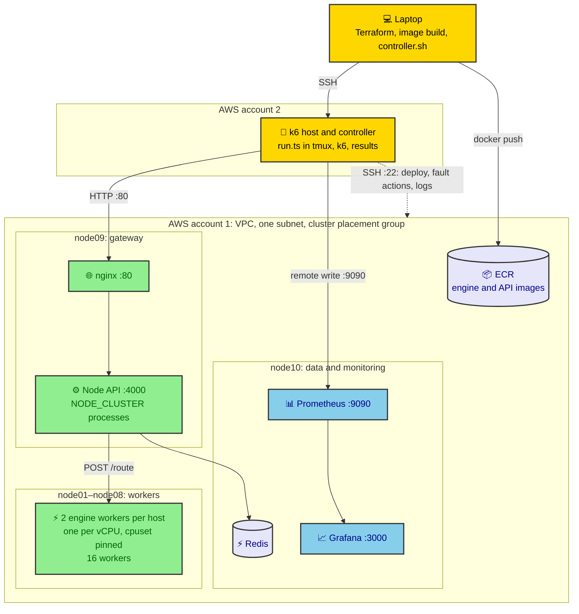

Two layouts are used:

| Layout | Worker hosts | Workers | API hosts × processes | Used by |
|---|---|---|---|---|
| Default | node01–node08 | 16 | 1 × 1 (node09) | E1, E2, E3, E14 |
| `gw2-cluster2` (`API_HOSTS=2 NODE_CLUSTER=2`) | node01–node07 | 14 | 2 × 2 (node08, node09) | E8 onwards, all other experiments |

Roles live in `deploy/inventory.json`; `deploy/render.ts` turns the inventory plus a variant
(`deploy/variants/*.env` and `KEY=VALUE` overrides) into one compose file per host, and `deploy/deploy.sh`
starts them in phases over SSH. Security group: everything inside the group; the admin IP on 22 and 3000;
the k6 Elastic IP on 80, 9090 and 22.

### Observability

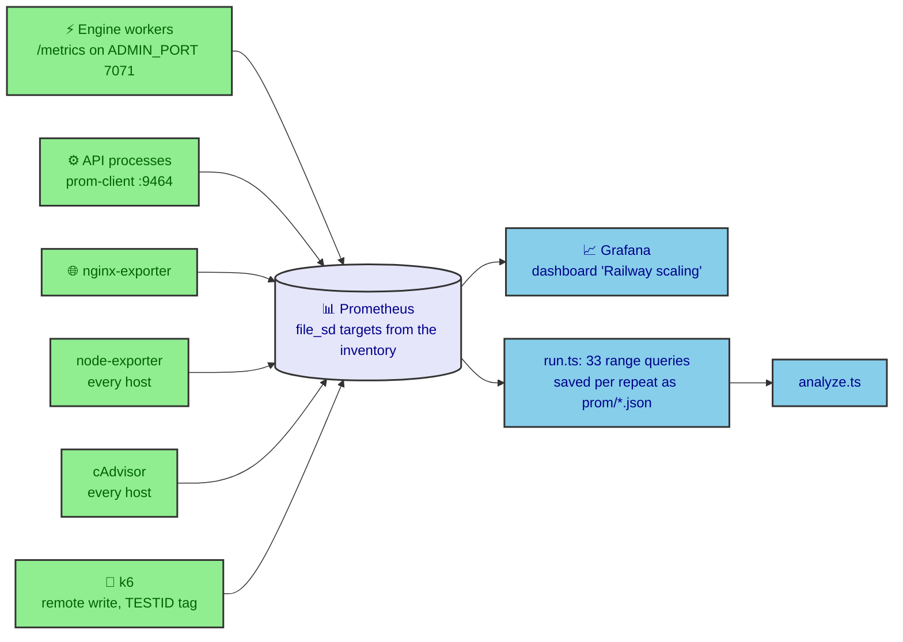

### Experiments

The catalogue is code (`loadtest/experiments.ts`): each experiment is a list of variants, and a variant is
one deployment plus one k6 run, optionally with timed fault actions. Each variant runs 3 times.

| Id | Experiment | Varies | Scenario |
|---|---|---|---|
| E1 | Worker count scaling | 1, 2, 4, 8, 12, 16 workers | breakpoint |
| E2 | Placement and hyperthreading | 8 workers: one per host, two per host, unpinned | breakpoint |
| E3 | Threads per worker and pool concurrency | `ENGINE_THREADS` 1/2/4 × `ENGINE_CONCURRENCY` 1/2 | breakpoint |
| E4 | Load-balancing strategy | 6 strategies × uniform and heavy-tailed mix | load |
| E5 | Where to balance (nginx vs Node pool) | not run, see below | |
| E6 | Heterogeneous pools | not run, see below | |
| E7 | Hedged requests | `HEDGE_AFTER_MS` off, 100, 250 | load |
| E8 | Node tier scaling | 1–4 API hosts × 1 or 2 processes | breakpoint |
| E9 | Payload cost | page size 10 or 50 × gzip off or on | breakpoint |
| E10 | Cache | no cache, Redis, Redis + warmer × zipf s 0, 0.8, 1.1, 1.4 | load |
| E11 | Cache stampede | no coalescing, in-process coalescing, Redis lock | load, 30 s cold burst |
| E12 | Overload behaviour | unlimited queue, 429 cap, 1 s timeout, retry storm at 1.5× and 2× capacity | load |
| E13 | Failure injection | kill 1, 4 or 8 workers, or Redis, at 60 s; restart at 180 s | load |
| E14 | Elastic scaling | 8 workers, 8 more join through the Redis registry at 60 s | load |
| E15 | K and label budget | `TOP_K` 10/20/50 × `MAX_LABELS` 200k/500k | breakpoint |
| E16 | Closed vs open loop | constant arrival rate vs constant VUs | load, closed |
| E17 | Spike and soak on the chosen configuration | spike to 1.5× capacity; 60 min soak | spike, soak |
| E18 | Little's law and queueing | load sweep 20–100 % of capacity | load |

E5 and E6 are out of scope. E5: the engine answers compact journeys that only the API can render, so nginx
cannot send `/api/routes` straight to the workers. E6: the API has no query-cost predictor or pool split.

### Running an experiment

Experiments run on the k6 host inside tmux, so the laptop's connection may drop. `deploy/controller.sh`
is the laptop side: `setup`, `push`, `run`, `status`, `attach`, `pull`.

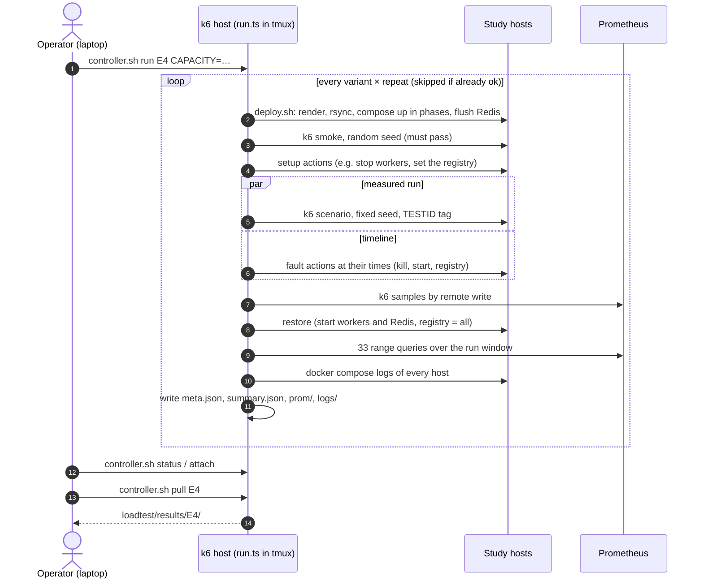

```bash
node loadtest/run.ts --list                  # experiments, questions and params (offline)
node loadtest/run.ts E8 --dry-run            # every command, without running anything
deploy/controller.sh run E8                  # on the k6 host: 8 variants × 3 repeats
deploy/controller.sh status                  # running or idle, last log lines
deploy/controller.sh pull E8                 # results to loadtest/results/E8/
node loadtest/analyze.ts                     # tables and charts -> docs/load-test/
```

A repeat whose `meta.json` says `ok` is skipped on a rerun, so an interrupted experiment resumes where it
stopped. The full procedure, including provisioning, what to watch in Grafana and teardown, is in
[`docs/experiment-runbook.md`](docs/experiment-runbook.md); the exact ordered commands from E8 to the end
are in [`docs/next_sequence_commands.md`](docs/next_sequence_commands.md).

Run order and estimated run time, about 25 hours of machine time for 3 repeats (the axis is elapsed
time: `D01 06:00` is 6 hours in, `D02` starts at 24 hours):

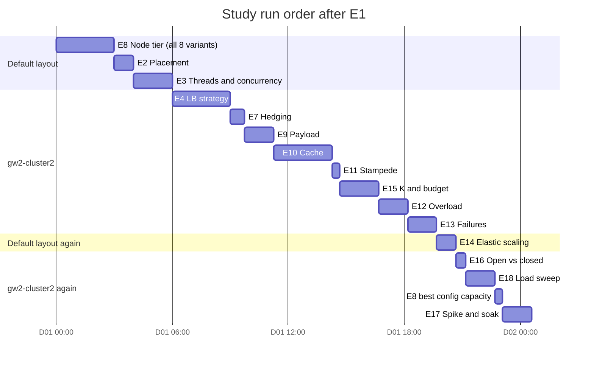

E8 itself runs on all four API-host layouts; the section names say which layout the other experiments use.

### From results to the report

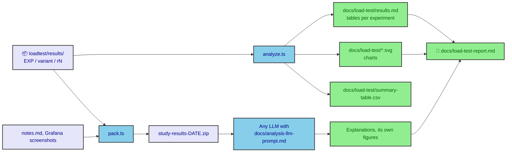

`analyze.ts` computes, per variant, the median and spread over repeats; for breakpoint runs the maximum RPS
within the SLO (the highest achieved rate before the SLO is broken for two consecutive 5 s steps); for E1 a
Universal Scalability Law fit; for fault runs detection and recovery times; and for E18 a check of Little's
law and an M/M/c prediction. It needs nothing but Node, and can be rerun after every experiment.

---

## Testing

| Suite | Command | What it covers |
|---|---|---|
| Preprocessing and geocoding (15 tests) | `cd scripts && npm test` | Overnight rule (including KUR 23:45/00:05 doj 2), code recovery, name canonicalization, policies; coordinate interpolation and the outlier guard |
| Engine (27 cases, about 648k assertions) | `routing-engine/build/engine_tests` | See below |
| API (39 tests) | `cd api && npm test` | Validation and error codes, pagination, filters, Redis cache, prewarm, coalescing, every pool strategy, ejection, retry, hedging, 429, no-route message, engine-down 503, semaphore, renderer parity with the engine's former output, timetable hash |
| Types | `cd api && npx tsc --noEmit` | |
| Study tooling (33 tests) | `node --test loadtest/test/*.test.ts` | Every variant of every experiment renders on the default inventory, knob names match `k6.sh`, CLI parsing; the analysis: capacity rule, counter resets, USL fit, Erlang C, charts |
| Frontend build | `cd frontend && npx next build` | Type check and build |

The engine suites are:

- `test_time`: civil date/time arithmetic.
- `test_router`: hand-built scenarios:
  - A 30-min transfer is accepted and a 29-min one rejected.
  - A next-day first departure is rejected.
  - Instances that started the previous day are used.
  - A 2-transfer journey beats a direct train.
  - Loop trains, no station touched twice, and duplicate signatures.
  - Each dominance rule, including the JHN→DUMK regression.
  - Budget semantics.
- `test_oracle`: **differential testing** against a brute-force enumerator on random small timetables.
  The top-K must be identical. The default is 250 iterations; soak runs use
  `ORACLE_ITERS=1500 ORACLE_SEED=n`. About 22,700 queries across seeds have been checked with 0
  mismatches.
- `test_dataset`: real-data invariants over 200 random queries plus BD→NDLS:
  - Valid chaining and transfers of at least 30 minutes.
  - Monotone times and no repeated stations.
  - Unique signatures and sorted ranks.
  - Operating days respected.

---

## Known limitations

- **Work budget**: about 2.4 % of random queries (typically distant, poorly connected pairs) hit
  `MAX_LABELS` and return fewer than 50 journeys. The results returned are still exact and in rank order,
  and the response is flagged `search_complete: false`. Raising the budget trades latency for
  completeness.
- **Time zone**: naive IST, with no DST handling (none is needed in India).
- No platform, fare or seat-availability data. `platform` is always null in the source data.
- The minimum transfer is one global value, not per station.
- The map's station positions are approximate for the 110 interpolated stations, and 35 small stations
  have no position. Codes the raw data reuses for two stations (BPR, MGR) draw a visible jump.
- `K_NODE > 0` makes the search approximate. It is off by default.
- The API image and the engine image each build `timetable.json` from the raw data (the file is
  deterministic: no timestamp). If they ever differ (a different `CLEAN_POLICY`, or images built from
  different commits), the API refuses to start.

## Future work

- A binary, memory-mapped timetable format, for faster cold starts and a smaller image.
- Caching backward profiles per (destination, date window), which is reusable across sources.
- RAPTOR-style round pruning to shrink the label space for long-distance pairs.
- Per-station minimum transfer times, if such data becomes available.
- Pools split by predicted query cost, so the slow 2 % of searches cannot block the fast ones (E6).
- Rendering in the worker's path, which would allow balancing at nginx without the Node pool (E5).
- A timetable version in the deployment, so a new timetable can roll out worker by worker.
