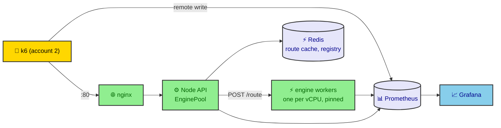

# Load-test report: scaling the railway routing system on AWS

Status: **in progress**. E1 has run. The numbers, tables and charts for every experiment that has run are in
[`load-test/results.md`](load-test/results.md), which `node loadtest/analyze.ts` regenerates. This file holds
what the script cannot write: the setup, the explanations and the conclusions. Each "Explanation" below is
filled in after that experiment has run.

## 1. Goals

Learn how the system scales and what limits it, through controlled comparisons where one thing changes at a
time: worker count, placement, load balancing, the API tier, caching, overload and failures. A production
deployment is not the goal. The plan is [`scaling-plan.md`](scaling-plan.md).

## 2. Environment

| Item | Value |
|---|---|
| Hosts | 10 × m7i-flex.large (2 vCPU = one physical core with hyperthreading, 8 GB), Ubuntu 24.04 |
| Network | One VPC, one subnet, one cluster placement group, region us-east-1; host networking for every container |
| Load generator | One m7i-flex.large in a second AWS account (k6, also the experiment controller) |
| Images | Engine and API images from ECR, tagged with the git commit (recorded in every `meta.json`) |
| Monitoring | Prometheus and Grafana on node10; node-exporter and cAdvisor on every host |

"16 workers" means 16 vCPUs on 8 physical cores: from 9 workers on, two workers share a core as hyperthread
siblings.

Two layouts are used. Their capacities are not comparable as if both had 16 workers.

| Layout | Workers | API | Experiments |
|---|---|---|---|
| Default | 16 on node01–node08 | 1 process on node09 | E1, E2, E3, E14 |
| `gw2-cluster2` | 14 on node01–node07 | 2 processes on each of node08 and node09 | E8 onwards, all others |

On `gw2-cluster2` each of the 4 API processes has its own pool, so `ENGINE_CONCURRENCY` (2) and `MAX_QUEUE`
apply per process: a worker can receive up to 8 requests at once, and 429s start later than on the default
layout.

## 3. Architecture

The details are in the [README](../README.md#scaling-architecture).

## 4. Method

- **SLO**: p99 latency < 500 ms and error rate < 0.1 % at the client. A 429 counts as an error.
- **Capacity** = the maximum RPS within the SLO. For a breakpoint run (an open-loop ramp) it is the highest
  achieved rate before the SLO is broken for two consecutive 5 s steps, using the API's windowed p99 and
  the client's status codes, after 30 s of warm-up.
- **Workloads**: `uniform` (every query distinct, so the cache does not help), `zipf` (popular pairs),
  a heavy-tailed mix (`HEAVY_FRAC` of the slowest queries). Fixed seeds: repeats send the same queries.
- **Open loop**: arrival rates are fixed by k6 (`constant-arrival-rate`, `ramping-arrival-rate`), so slow
  answers do not slow the load down. E16 compares this with a closed loop.
- **Repeats**: 3 per variant. Tables show the median and the min–max; a spread above 10 % is flagged.
- **Cold start**: every repeat redeploys and flushes Redis, then must pass a smoke test with 0 errors.
- **Pinning**: each worker is pinned to one vCPU (`cpuset`), except where the experiment says otherwise.

## 5. Experiments

### E1 Worker count scaling

**Question.** How does the maximum RPS within the SLO grow with 1–16 workers, and where does it stop being
linear?

**Setup.** Default layout, 1, 2, 4, 8, 12 and 16 workers ("spread": one per host before a second per host),
uniform workload, breakpoint ramp over 5 min to 50 × workers + 50 RPS.

**Result.** [results.md, E1](load-test/results.md#e1-worker-count-scaling): capacity per worker count, the
USL fit, efficiency, and the CPU of each tier at the knee.

**Explanation.** _To write. Points to cover: which tier's CPU is saturated at the knee for 12 and 16 workers
(the single API process or the workers); what ends each run (latency or 429s); the variants whose ramp
ended before the SLO broke (their capacity is a lower bound and the ramp ceiling was too low); the effect of
hyperthread siblings above 8 workers; what σ and κ mean here._

### E2 Placement and hyperthreading

**Question.** Do 8 workers perform differently as one per host, two hyperthread siblings per host on 4
hosts, or one unpinned per host?

**Setup.** Default layout, 8 workers, breakpoint. Variants `spread-8hosts`, `pack-4hosts`, `unpinned-8hosts`.

**Result.** [results.md, E2](load-test/results.md#e2-placement-and-hyperthreading)

**Explanation.** _To write._

### E3 Threads per worker and pool concurrency

**Question.** What do 1, 2 or 4 engine threads on one pinned vCPU give, when the pool sends 1 or 2 requests
at a time to each worker?

**Setup.** Default layout, breakpoint. `ENGINE_CONCURRENCY` 1/2 × `ENGINE_THREADS` 1/2/4.

**Result.** [results.md, E3](load-test/results.md#e3-threads-per-worker-and-pool-concurrency)

**Explanation.** _To write._

### E4 Load-balancing strategy

**Question.** Which strategy gives the best tail latency at 70 % load, for uniform queries and for a
heavy-tailed mix? With several API processes, does `least_reported` beat `least_outstanding` and `p2c`?

**Setup.** `gw2-cluster2`, fixed load for 3 min. 6 strategies × {uniform, 10 % heavy queries}.

**Result.** [results.md, E4](load-test/results.md#e4-load-balancing-strategy)

**Explanation.** _To write._

### E5 Where to balance (nginx vs Node pool)

Not run. The engine answers compact journeys that only the API can render, so nginx cannot send
`/api/routes` straight to the workers.

### E6 Heterogeneous pools

Not run. The API has no query-cost predictor or pool split.

### E7 Hedged requests

**Question.** How much p99 does hedging after 100 or 250 ms gain on the heavy-tailed mix, and what extra
engine load does it cost?

**Setup.** `gw2-cluster2`, fixed load for 3 min, `HEDGE_AFTER_MS` 0, 100, 250.

**Result.** [results.md, E7](load-test/results.md#e7-hedged-requests)

**Explanation.** _To write._

### E8 Node tier scaling

**Question.** With 1–4 API hosts (16, 14, 12, 10 workers) and 1 or 2 API processes per host, when does Node
stop being the limit, and which split of the 10 hosts gives the most capacity?

**Setup.** Breakpoint. Variants `gw1`–`gw4` × `cluster1`/`cluster2`.

**Result.** [results.md, E8](load-test/results.md#e8-node-tier-scaling)

**Explanation.** _To write. Include why `gw2-cluster2` was chosen for the rest of the study._

### E9 Payload cost

**Question.** What do the rendered page size (10 or 50 journeys) and gzip at nginx cost in bytes, API CPU
and capacity?

**Setup.** `gw2-cluster2`, breakpoint. `PAGE_SIZE` 10/50 × `GZIP` off/on.

**Result.** [results.md, E9](load-test/results.md#e9-payload-cost)

**Explanation.** _To write._

### E10 Cache

**Question.** What do Redis and Redis with the cache-warmer give over no cache, as query popularity gets
more skewed?

**Setup.** `gw2-cluster2`, fixed load at 70 % for 3 min, zipf s = 0, 0.8, 1.1, 1.4.

**Result.** [results.md, E10](load-test/results.md#e10-cache)

**Explanation.** _To write._

### E11 Cache stampede

**Question.** In a cold burst of mostly identical queries on several API processes, how many engine calls
do no coalescing, in-process coalescing and the Redis lock make?

**Setup.** 2 API processes per host, 30 s at 50 % load, zipf s = 3, cold cache.

**Result.** [results.md, E11](load-test/results.md#e11-cache-stampede)

**Explanation.** _To write._

### E12 Overload behaviour

**Question.** At 1.5× and 2× capacity, what happens to goodput and latency with an unlimited queue, a queue
cap with 429s, a 1 s engine timeout, and a timeout with 3 retries?

**Setup.** `gw2-cluster2`, fixed load for 2 min.

**Result.** [results.md, E12](load-test/results.md#e12-overload-behaviour)

**Explanation.** _To write._

### E13 Failure injection

**Question.** When 1, 4 or 8 workers, or Redis, are killed mid-run, how fast is it detected, how large is
the error burst, and how does recovery look after the restart?

**Setup.** `gw2-cluster2` (so `kill8` is 8 of 14 workers), fixed load at 60 % for 5 min; kill at 60 s,
restart at 180 s.

**Result.** [results.md, E13](load-test/results.md#e13-failure-injection)

**Explanation.** _To write._

### E14 Elastic scaling

**Question.** Starting with 8 workers above their capacity, how long after 8 more join through the Redis
registry does the system recover?

**Setup.** Default layout, fixed load at 70 % of the 16-worker capacity for 5 min. Variants `join` (the other
8 start at 60 s), `static8`, `static16`.

**Result.** [results.md, E14](load-test/results.md#e14-elastic-scaling)

**Explanation.** _To write._

### E15 K and label budget

**Question.** How do `TOP_K` (10, 20, 50) and `MAX_LABELS` (200k, 500k) trade capacity against
completeness?

**Setup.** `gw2-cluster2`, breakpoint.

**Result.** [results.md, E15](load-test/results.md#e15-k-and-label-budget)

**Explanation.** _To write._

### E16 Closed vs open loop

**Question.** At the same load, how much of the latency tail does a closed-loop test hide?

**Setup.** `gw2-cluster2`, 3 min at 80 % load: constant arrival rate vs constant VUs.

**Result.** [results.md, E16](load-test/results.md#e16-closed-vs-open-loop)

**Explanation.** _To write._

### E17 Spike and soak on the chosen configuration

**Question.** How long does recovery take after a spike to 1.5× capacity, and does anything drift over 60
minutes?

**Setup.** The best configuration found (write it here), capacity from `E8/gw2-cluster2-best`.

**Result.** [results.md, E17](load-test/results.md#e17-spike-and-soak-on-the-chosen-config)

**Explanation.** _To write._

### E18 Little's law and queueing

**Question.** Does measured concurrency equal arrival rate × latency, and how does latency against
utilisation compare with an M/M/c model?

**Setup.** `gw2-cluster2`, load sweep at 20, 40, 60, 80, 90 and 100 % of capacity, 3 min each.

**Result.** [results.md, E18](load-test/results.md#e18-littles-law-and-queueing)

**Explanation.** _To write._

## 6. Summary of findings

| Experiment | Key numbers | Conclusion | Confidence |
|---|---|---|---|
| E1 | | | |
| E2 | | | |
| E3 | | | |
| E4 | | | |
| E7 | | | |
| E8 | | | |
| E9 | | | |
| E10 | | | |
| E11 | | | |
| E12 | | | |
| E13 | | | |
| E14 | | | |
| E15 | | | |
| E16 | | | |
| E17 | | | |
| E18 | | | |

The machine-readable version is [`load-test/summary-table.csv`](load-test/summary-table.csv).

## 7. Recommended configuration

_To write after E17: layout, `LB_STRATEGY`, hedging, gzip, `MAX_QUEUE`, cache settings, and what to change
first to scale further._

## 8. Threats to validity

- Cloud noise: shared hosts, and m7i-flex instances do not guarantee full CPU all the time.
- Hyperthread siblings: above 8 workers, two workers share a physical core.
- One load generator, in another account and network path.
- The capacity rule uses the API's windowed p99, which excludes nginx and the network (a few ms), and
  30 s rate windows, which lag a ramp by a few seconds.
- A breakpoint run that ends before the SLO breaks gives only a lower bound.
- Three repeats give a spread, not a confidence interval.
- The queries are synthetic; about 70 % of uniform pairs have a route, and 2.5 % hit the label budget.

## 9. Cost of the study

_To write: instance hours × price, per session._
